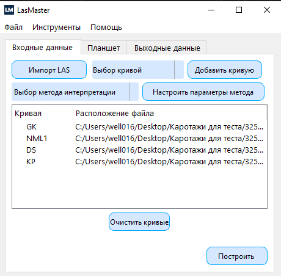
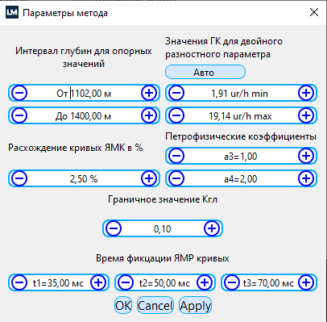
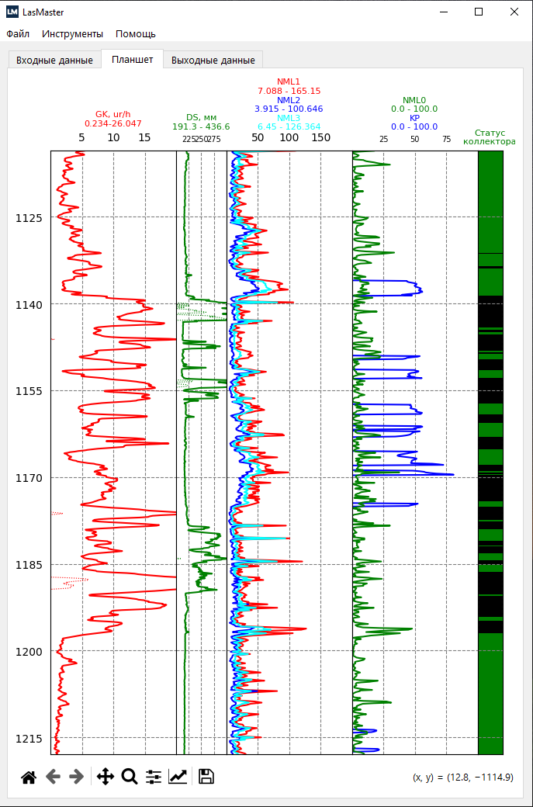
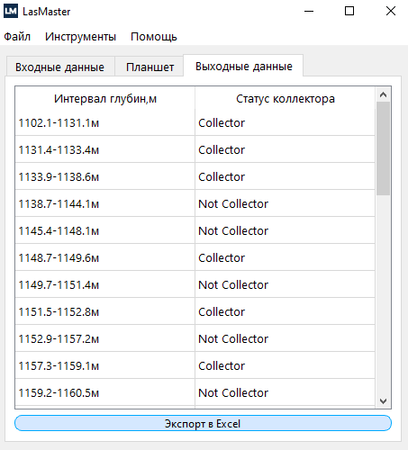

# LasMaster

LasMaster — это графическое приложение для работы с LAS-файлами, которое позволяет импортировать данные скважин, выбирать и анализировать кривые, настраивать параметры, визуализировать результаты и экспортировать данные в Excel.(На данный момент доступен только автоматический анализ по кривым ЯМК)
> 🤝 Если у Вас есть идеи как сделать проект лучше, не стесняйтесь присылать [issues](https://github.com/well016/LasMaster/issues) и [pull requests](https://github.com/well016/LasMaster/pulls).

> 🌙 Для лучшего восприятия включите [темную тему](https://github.com/settings/appearance).

<!--Блок информации о репозитории в бейджах-->


## Возможности
- **Импорт LAS-файлов**: Загрузка данных из файлов формата .las.
- **Выбор кривых**: Возможность выбора необходимых кривых для анализа.
- **Настройка параметров**: Сохранение и загрузка пользовательских настроек из файла `settings.json`.
- **Построение графиков**: Визуализация данных с использованием Matplotlib.
- **Экспорт данных**: Сохранение результатов анализа в формате Excel.
## Пример работы
### 1)Главное окно приложения 
 
### 2)Параметры метода

### 3)Вкладка с планшетом

### 4)Выходные данные


## Установка

### Требования
- Python 3.12
- PySide6
- Matplotlib
- Pandas
- Lasio
- Другие зависимости из `requirements.txt`

### Шаги установки

1. Клонируйте репозиторий:

   ```bash
   git clone https://github.com/well016/LasMaster.git
   cd LasMaster
   ```

2. Установите необходимые зависимости:

   Рекомендуется использовать виртуальное окружение:

   ```bash
   python -m venv venv
   source venv/bin/activate  # Для Linux/Mac
   venv\Scripts\activate  # Для Windows
   ```

3. Установите зависимости:

   ```bash
   pip install -r requirements.txt
   ```

## Использование

1. Запустите приложение:

   ```bash
   python main.py
   ```

2. Импортируйте LAS-файл:
   - Перейдите в меню "Файл" и выберите "Импорт".
   - Выберите нужный `.las` файл для загрузки данных.

3. Добавьте кривые для анализа:
   - В выпадающем списке выберите кривую и нажмите кнопку "Добавить кривую".
   - Добавленные кривые отобразятся в списке выбранных кривых.

4. Настройте параметры метода:
   - Нажмите кнопку "Настройки метода".
   - Установите необходимые параметры.
   - Сохраните параметры.

5. Постройте график:
   - Нажмите кнопку "Построить", чтобы визуализировать данные.
   - График отобразится во вкладке планшет.

6. Экспортируйте результаты:
   - Нажмите кнопку "Экспорт в Excel" во вкладке выходные данные, чтобы сохранить результаты анализа в файл формата `.xlsx`.

## Структура проекта
- `main.py`: Главный файл приложения, содержащий класс `LasMaster`.
- `MyGraphics.py`: Модуль с функциями для чтения данных и анализа коллектора.
- `plot.py`: Модуль для отображения графиков в приложении.
- `Design/`: Папка с файлами пользовательского интерфейса, созданными с помощью Qt Designer.
  - `ui_main.py`
  - `ui_version.py`
  - `ui_nml_param.py`
- `settings.json`: Файл для хранения пользовательских настроек.

## Функции класса LasMaster
- `import_las`: Импортирует LAS-файл и загружает доступные кривые.
- `add_curve`: Добавляет выбранную кривую в список для анализа.
- `setting_meth`: Открывает окно настроек метода и загружает сохраненные параметры.
- `save_param`: Сохраняет текущие настройки пользователя в `settings.json`.
- `load_param`: Загружает параметры из `settings.json` при открытии настроек.
- `build_plot`: Строит график на основе выбранных кривых и настроек.
- `collector_status_table`: Отображает таблицу статуса коллектора.
- `open_version`: Открывает окно с информацией о версии приложения.
- `save_excel`: Экспортирует результаты анализа в файл Excel.

## Дополнительная информация
- **Версия приложения**: Информация о версии хранится в файле `settings.json` и отображается в разделе "О программе".
- **Обработка ошибок**: Приложение содержит базовую обработку исключений при импорте файлов и чтении настроек.
- **Логи**: Сообщения об ошибках выводятся в консоль.

